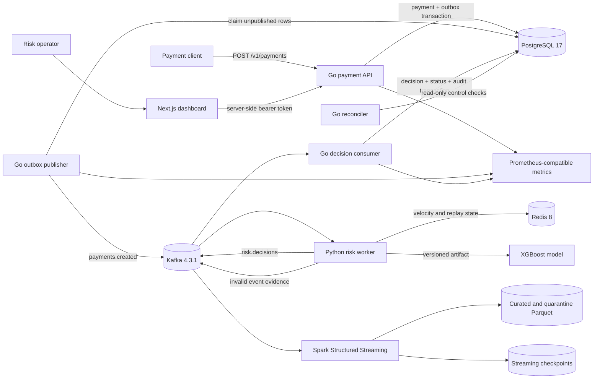
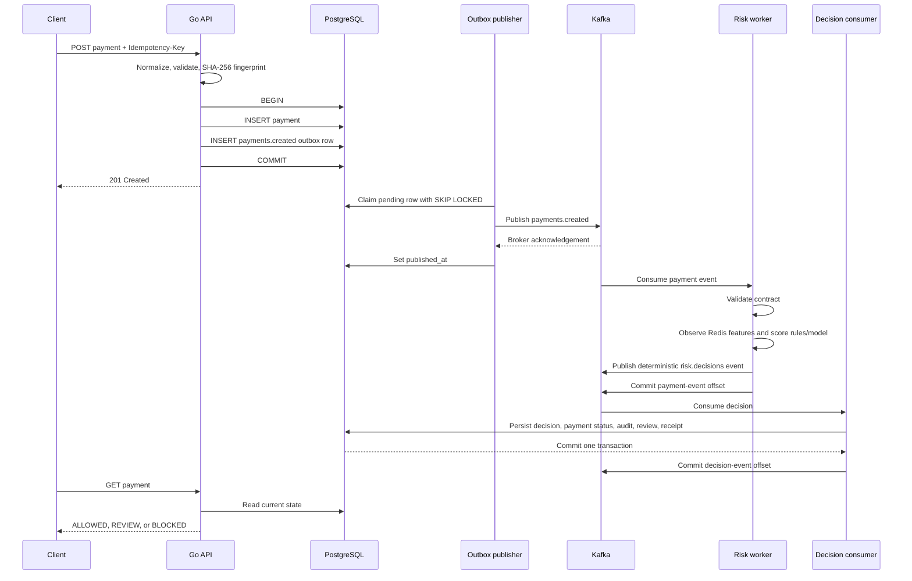

# RiskFlow architecture

## Scope

RiskFlow is a local, single-region engineering demonstration of a payment-risk workflow. It shows reliable transaction acceptance, asynchronous decisioning, operational controls, and recoverable analytics. It is not presented as a deployed bank system, a card processor, or a production fraud model.

## System view

All services run through Docker Compose. PostgreSQL is the transactional system of record. Kafka separates payment acceptance from risk processing. Redis holds online features and replay state; it is not the audit system of record. Spark writes analytical files and never participates in the payment request path.

## Payment-to-decision sequence

If the original HTTP call is retried, the unique idempotency key and normalized fingerprint return the original payment. If a worker crashes between an external acknowledgement and its local commit, Kafka may redeliver the event. Stable event IDs, Redis replay state, and PostgreSQL uniqueness make that duplicate harmless at the business-record level.

## Reliability boundaries

| Boundary | Guarantee | Deliberate limitation |
| --- | --- | --- |
| HTTP to PostgreSQL | Payment and outbox row commit together, or neither remains. | A successful response means accepted for asynchronous risk processing, not finally approved. |
| PostgreSQL to Kafka | An unpublished row remains durable and is retried after broker recovery. | Delivery is at least once; a crash around acknowledgement can duplicate the Kafka event. |
| Kafka to risk worker | Input offsets advance only after a decision or quarantine event is published. | Redis failure pauses the partition because RiskFlow will not invent velocity features. |
| Kafka to decision store | Decision, payment state, audit event, review item, and ingestion receipt share one database transaction. | A replay creates another immutable ingestion receipt but no duplicate domain decision. |
| Kafka to Parquet | Checkpoints retain source progress; malformed data is quarantined with source coordinates. | The local file lake is analytical and eventually updated, not a transactional source of truth. |

The full dependency behavior and measured outage evidence are in [reliability and failure behavior](reliability.md).

## Important design decisions

1. **Integer money:** `amount_minor` avoids floating-point rounding in financial values.
2. **Transactional outbox:** payment acceptance does not depend on Kafka being available, while every committed payment retains a durable event to publish.
3. **At-least-once plus idempotency:** RiskFlow does not claim an impossible cross-system exactly-once transaction. It makes safe retries explicit instead.
4. **Explainable conservative scoring:** rules provide readable reason codes; ML may escalate to review, and missing ML moves uncertainty to human review rather than silently allowing it.
5. **Immutable control evidence:** decisions, audit events, and ingestion receipts cannot be edited or deleted through normal database statements.

## Deployment and security boundary

The checked-in deployment target is local Docker Compose. Kafka uses plaintext listeners, the API uses local HTTP, and dashboard bearer tokens come from local environment configuration. Before a real deployment, the system would need managed secrets, TLS, identity-aware access, encrypted broker/database connections, backups, multi-instance capacity testing, retention policies, and infrastructure-specific observability. No public deployment is claimed.

See [database architecture](database.md), [API examples](api-examples.md), [measured benchmarks](benchmarks.md), and [demo scripts](demo.md) for the concrete verification path.
