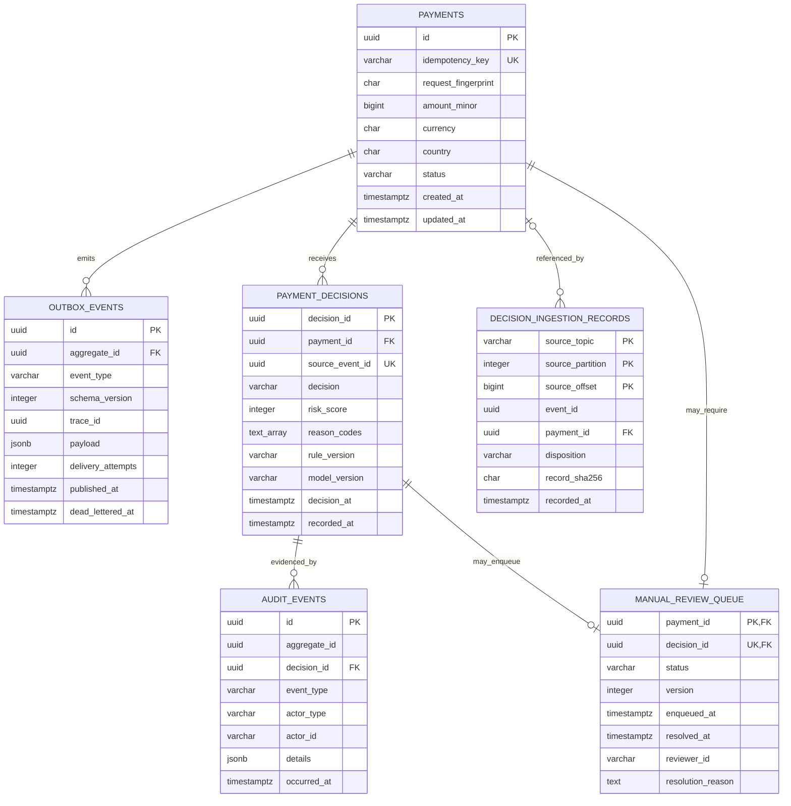

# Database architecture

PostgreSQL is RiskFlow's transactional system of record. The API and workers use explicit transactions, while `golang-migrate` applies versioned schema changes before application startup.

## Entity relationship diagram



`DECISION_INGESTION_RECORDS.payment_id` is nullable because rejected Kafka bytes may not contain a trustworthy payment ID. The diagram omits some scoring and retry columns for readability; the migrations are the authoritative schema.

## Table responsibilities

| Table | Responsibility | Key control |
| --- | --- | --- |
| `payments` | Current payment state and the normalized request identity. | Unique `idempotency_key`; positive integer amount; bounded status values. |
| `outbox_events` | Durable events waiting for or completing Kafka publication. | Foreign key to payment, persisted retry state, and mutually exclusive published/dead-letter states. |
| `payment_decisions` | Immutable automated decision history and explainability evidence. | Unique source event, score bounds, schema version, immutable trigger. |
| `decision_ingestion_records` | Immutable receipt for every applied, replayed, or rejected Kafka record. | Kafka topic/partition/offset primary key and a constraint tying evidence fields to disposition. |
| `audit_events` | Immutable system and reviewer actions. | Decision foreign key, unique event type per decision, immutable trigger. |
| `manual_review_queue` | Current manual-review workflow state. | One row per payment, optimistic `version`, and resolved-state evidence constraint. |
| `schema_migrations` | Migration version and dirty flag maintained by `golang-migrate`. | Migration runner starts before the API and workers. |

## Transaction boundaries

### Payment acceptance

One PostgreSQL transaction inserts the payment and its `payments.created` outbox event. If either insert fails, the transaction rolls back and neither row remains.

### Risk-decision persistence

One PostgreSQL transaction inserts the decision and ingestion receipt, changes the payment status, adds the system audit event, and conditionally enqueues manual review. The Kafka offset advances only after this transaction commits.

### Manual resolution

One PostgreSQL transaction checks the caller's expected review version, resolves the queue item, changes the payment state, and records the reviewer audit event. A stale version returns a typed conflict instead of overwriting another reviewer.

## Migration order

| Version | Purpose |
| --- | --- |
| `000001_initial` | Payments, normalized idempotency fingerprint, and transactional outbox. |
| `000002_outbox_delivery_controls` | Durable retries, retry index, and dead-letter evidence. |
| `000003_risk_decision_persistence` | Decisions, ingestion receipts, immutable audit history, and manual-review queue. |
| `000004_manual_review_controls` | Requires a non-empty resolution reason when a review is resolved. |
| `000005_dashboard_reporting_indexes` | Adds the bounded recent-decision reporting index. |

The up and down files live in `database/migrations`. Down migrations reverse dependencies in safe order, but production-style rollback should still be planned and backed up rather than run automatically.

Verify the migration state:

```powershell
docker exec riskflow1-postgres sh -c 'psql -U "$POSTGRES_USER" -d "$POSTGRES_DB" -c "SELECT version, dirty FROM schema_migrations;"'
```

Expected current version: `5`, with `dirty = false`.

## Useful control queries

```sql
-- Payment and outbox cardinality by payment.
SELECT p.id, count(o.id) AS outbox_count
FROM payments p
LEFT JOIN outbox_events o ON o.aggregate_id = p.id
GROUP BY p.id
HAVING count(o.id) <> 1;

-- Pending or failed publication work.
SELECT id, aggregate_id, delivery_attempts, next_attempt_at, last_error
FROM outbox_events
WHERE published_at IS NULL AND dead_lettered_at IS NULL
ORDER BY next_attempt_at, created_at;

-- Pending reviews with their explainability evidence.
SELECT q.payment_id, q.version, d.risk_score, d.reason_codes,
       d.rule_version, d.model_version
FROM manual_review_queue q
JOIN payment_decisions d ON d.decision_id = q.decision_id
WHERE q.status = 'PENDING'
ORDER BY q.enqueued_at;
```

Run `docker compose run --rm decision-reconciler` for the checked-in exception report instead of treating ad hoc SQL as the only control.
