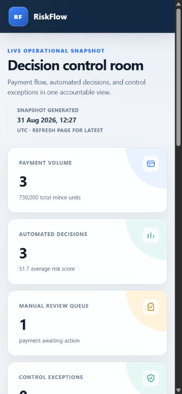

# Operational dashboard

Checkpoint 6B adds a server-rendered Next.js operator view at `http://localhost:3000`. It consumes the role-protected Go `GET /v1/dashboard` contract and does not query PostgreSQL, Kafka, Redis, or Spark directly.

## Security boundary

`DASHBOARD_API_TOKEN` is available only to the Next.js server. The loader adds it to the server-to-server request to the payment API. It is never returned in page props, embedded in browser JavaScript, written to logs, named with a `NEXT_PUBLIC_` prefix, or passed into the Docker build.

For local Compose use, `DASHBOARD_API_TOKEN` must exactly match a `risk_reviewer` or `risk_auditor` token in `REVIEW_AUTH_CREDENTIALS_JSON`. Prefer the read-only `risk_auditor` role.

This checkpoint protects the API credential but does not implement human login or session management for the dashboard page itself. Do not expose the container directly to the public internet. A real deployment must put the page behind an identity-aware proxy or add application login, authorization, secure sessions, TLS, and CSRF protections where relevant.

## Displayed controls

The dashboard shows:

- payment count and summed integer minor units;
- allow, review, and block decision distribution;
- average score and latest rule/model versions;
- pending manual-review workload;
- unpublished, retrying, and dead-lettered outbox records;
- rejected decision events;
- reconciliation exception counts and reason codes;
- a bounded newest-first decision table with payment, merchant, customer, outcome, score, explainability codes, country, and timestamp.

`outbox_retrying` remains a subset of `outbox_pending`; the UI does not add them together. Totals containing multiple currencies are labelled as minor units rather than being presented as one currency amount.

## Configuration

| Variable | Default | Purpose |
| --- | --- | --- |
| `DASHBOARD_API_URL` | Set to `http://payment-api:8080` by Compose | Payment API base URL used by the Next.js server |
| `DASHBOARD_API_TOKEN` | Required | Read-only reviewer/auditor bearer token |
| `DASHBOARD_RECENT_LIMIT` | `20` | Recent decisions requested, from 1 through 100 |
| `DASHBOARD_FETCH_TIMEOUT_MS` | `7000` | Server-to-server request timeout, from 100 through 30000 milliseconds |
| `DASHBOARD_PORT` | `3000` | Host port published by Compose |

Invalid or missing server configuration produces a safe error screen. API authentication failures, timeouts, unreachable services, malformed JSON, and unexpected response contracts are also mapped to operator-safe messages without returning upstream bodies.

## Local verification

Set the same auditor token in both local variables, then start the stack:

```powershell
docker compose up -d --build
docker compose ps
Invoke-RestMethod http://localhost:3000/healthz
Invoke-WebRequest http://localhost:3000 -UseBasicParsing
```

Run the standalone frontend checks:

```powershell
Push-Location services/dashboard
npm ci
npm run format:check
npm run lint
npm test
npm run build
Pop-Location
```

The production image uses Next.js standalone output, runs as an unprivileged `nextjs` user, and receives secrets only when its container starts.

## Verified views

The checked-in screenshots were captured from the production Compose container against the local API and PostgreSQL records used for functional verification. They are not design mockups or production screenshots.



